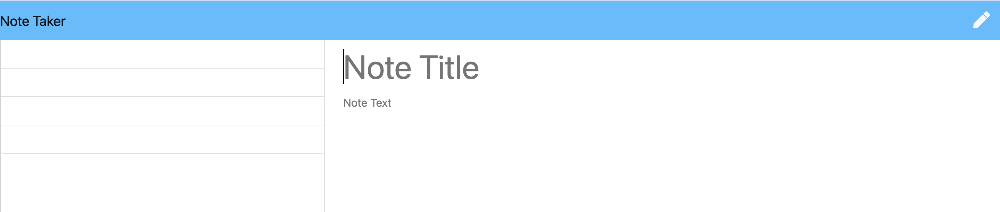

# take-notes

## Description

Created an application called Note Taker that can be used to write and save notes. This application will use an Express.js back end and will save and retrieve note data from a JSON file.

## User Story

As a small business owner, I want to be able to write and save notes so that I can organize my thoughts and keep track of tasks I need to complete.

## Acceptance Criteria

Given a note-taking application, when I open the Note Taker then I am presented with a landing page with a link to a notes page. When I click on the link to the notes page then I am presented with a page with existing notes listed in the left-hand column, plus empty fields to enter a new note title and the note's text in the right-hand column. When I enter a new note title and the note's text then a "Save Note" button and a "Clear Form" button appear in the navigation at the top of the page. When I click on the Save button then the new note I have entered is saved and appears in the left-hand column with the other existing notes and the buttons in the navigation disappear. When I click on an existing note in the list in the left-hand column then that note appears in the right-hand column and a "New Note" button appears in the navigation. When I click on the "New Note" button in the navigation at the top of the page then I am presented with empty fields to enter a new note title and the note's text in the right-hand column and the button disappears.

## Installation

Install:
 - Node: "npm init" 
 - express package: "npm i express"
 - uuid version 4: "npm i uuidv4"
 - Jquery: "npm i jquery"

## Images

### Preview 1

### Preview 2

### Preview 3

## Deployment Link

[Link](https://hidden-brook-08790-cb94b3d76c41.herokuapp.com/)

## Credits

The starter code for the index.html, notes.html, style.css, and index.js for this project was used from a repository named "miniature-eureka" located from their Develop folder which can be accessed through the following link: https://github.com/coding-boot-camp/miniature-eureka.git

## License 

